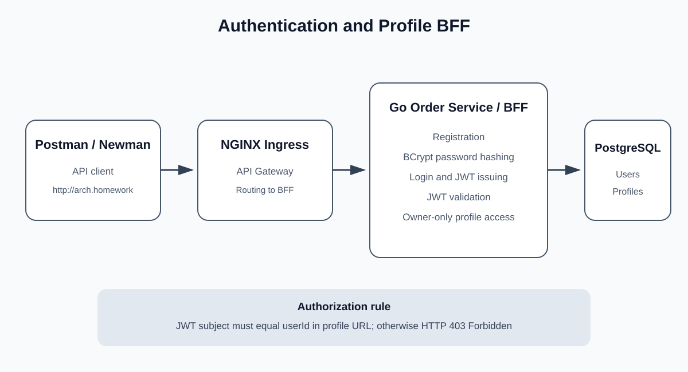

# Order Service

Учебный сервис на Go с PostgreSQL и развёртыванием в Kubernetes.

Проект последовательно развивается в рамках домашних заданий по микросервисной архитектуре и включает:

- REST API;
- PostgreSQL;
- Docker;
- Kubernetes;
- NGINX Ingress;
- Prometheus и Grafana;
- централизованное логирование через EFK;
- регистрацию и аутентификацию пользователей;
- JWT-авторизацию;
- безопасную работу с пользовательским профилем.

## Возможности

- регистрация пользователей;
- вход по логину и паролю;
- хранение паролей в виде BCrypt-хеша;
- выдача JWT после успешного входа;
- проверка подписи и срока действия JWT;
- просмотр собственного профиля;
- изменение собственного профиля;
- запрет доступа к профилю другого пользователя;
- health-check приложения и PostgreSQL;
- Prometheus metrics;
- конфигурация приложения через ConfigMap;
- хранение доступов и JWT secret через Kubernetes Secret;
- миграции PostgreSQL через Kubernetes Job;
- две реплики приложения в Kubernetes;
- доступ через NGINX Ingress;
- централизованное логирование через Elasticsearch, Fluent Bit и Kibana;
- мониторинг через Prometheus и Grafana.

## Архитектура

Схема аутентификации и BFF:



Основной маршрут запроса:

```text
Postman / Newman
        |
        v
NGINX Ingress
   API Gateway
        |
        v
Go Order Service / BFF
        |
        +-- Registration
        +-- Login
        +-- BCrypt
        +-- JWT
        +-- Authorization
        +-- Profile
        |
        v
PostgreSQL
```

NGINX Ingress используется в качестве единой точки входа и API Gateway.

Go-приложение выполняет роль BFF для сценария регистрации,
аутентификации и работы пользователя со своим профилем.

## API

| Метод | URL | Доступ | Описание |
|---|---|---|---|
| GET | `/health` | публичный | Проверка состояния приложения и PostgreSQL |
| GET | `/health/` | публичный | Проверка состояния приложения и PostgreSQL |
| GET | `/metrics` | публичный | Метрики Prometheus |
| POST | `/register` | публичный | Регистрация пользователя |
| POST | `/login` | публичный | Вход и получение JWT |
| GET | `/profile/{userId}` | Bearer JWT | Получение собственного профиля |
| PUT | `/profile/{userId}` | Bearer JWT | Изменение собственного профиля |

## Аутентификация

При регистрации пароль пользователя не сохраняется в открытом виде.

Приложение создаёт BCrypt-хеш и сохраняет его в PostgreSQL:

```text
password_hash
```

Пример регистрации:

```http
POST /register
Content-Type: application/json
```

```json
{
  "username": "user1",
  "password": "Password123!",
  "firstName": "User",
  "lastName": "One",
  "email": "user1@example.com",
  "phone": "+77010000001"
}
```

После успешной аутентификации:

```http
POST /login
```

сервер возвращает JWT:

```json
{
  "tokenType": "Bearer",
  "accessToken": "JWT_TOKEN",
  "expiresIn": 3600,
  "userId": 1
}
```

JWT подписывается алгоритмом HS256.

Срок действия access token:

```text
1 час
```

## Авторизация профиля

ID аутентифицированного пользователя хранится в стандартном JWT claim:

```text
sub
```

Для каждого запроса профиля приложение сравнивает:

```text
JWT sub == userId из URL
```

Возможные результаты:

```text
JWT отсутствует           -> 401 Unauthorized
JWT недействителен        -> 401 Unauthorized
пользователь читает себя  -> 200 OK
пользователь меняет себя  -> 200 OK
доступ к чужому профилю   -> 403 Forbidden
```

Таким образом аутентифицированный пользователь не может читать
или изменять профиль другого клиента.

## Logout

Отдельный endpoint logout не реализован.

Приложение использует stateless JWT.

Для выхода клиент удаляет access token.
После окончания срока действия JWT сервер также перестаёт принимать токен.

## Локальный запуск

Запустить PostgreSQL и приложение:

```bash
docker compose up --build -d
```

Проверить контейнеры:

```bash
docker compose ps
```

Health-check:

```bash
curl http://localhost:8000/health
```

Ожидаемый ответ:

```json
{
  "status": "OK"
}
```

Остановить приложение:

```bash
docker compose down
```

Для полного пересоздания локальной PostgreSQL:

```bash
docker compose down -v
```

## Сборка Docker-образа

```bash
docker build \
  -t order-service:4.0.0 \
  .
```

## Kubernetes

Приложение устанавливается в namespace:

```text
default
```

Используется Minikube.

Запуск:

```bash
minikube start
```

Проверка:

```bash
minikube status
kubectl get nodes
```

Включение NGINX Ingress Controller:

```bash
minikube addons enable ingress
```

## PostgreSQL

PostgreSQL устанавливается через Helm.

Helm release:

```text
order-db
```

Service PostgreSQL:

```text
order-postgresql
```

Настройки Helm:

```text
k8s/postgres-values.yaml
```

## Миграции

В проекте используются миграции:

```text
migrations/001_create_users.sql
migrations/002_add_authentication.sql
```

Вторая миграция добавляет:

```text
password_hash
```

В Kubernetes миграции запускаются через Job:

```text
order-service-migration
```

Проверка:

```bash
kubectl get jobs
kubectl logs job/order-service-migration
```

## Развёртывание приложения

Загрузить образ в Minikube:

```bash
minikube image load order-service:4.0.0
```

Применить Secret и ConfigMap:

```bash
kubectl apply \
  -f k8s/01-secret.yaml \
  -f k8s/02-configmap.yaml \
  -f k8s/03-migration-configmap.yaml
```

Перезапустить миграцию:

```bash
kubectl delete job \
  order-service-migration \
  --ignore-not-found

kubectl apply \
  -f k8s/04-migration-job.yaml
```

Установить приложение:

```bash
kubectl apply \
  -f k8s/00-ingress-class.yaml \
  -f k8s/05-deployment.yaml \
  -f k8s/06-service.yaml \
  -f k8s/07-ingress.yaml
```

Проверка:

```bash
kubectl get pods
kubectl get jobs
kubectl get svc
kubectl get ingress
```

Deployment запускает две реплики приложения.

## Ingress

Основной домен:

```text
arch.homework
```

Ingress направляет запросы:

```text
arch.homework
    |
    v
NGINX Ingress
    |
    v
order-service:80
    |
    v
order-service Pods:8000
```

В окружении WSL2 + Docker driver прямое обращение к IP Minikube
может быть недоступно.

Для локальной проверки используется port-forward Ingress Controller:

```bash
kubectl port-forward \
  -n ingress-nginx \
  service/ingress-nginx-controller \
  8080:80
```

В `/etc/hosts`:

```text
127.0.0.1 arch.homework
```

После этого приложение доступно:

```text
http://arch.homework:8080
```

## Postman

Коллекция для домашнего задания:

```text
postman/auth-bff.postman_collection.json
```

В коллекции используется переменная:

```text
{{baseUrl}}
```

Initial value:

```text
http://arch.homework
```

При каждом запуске автоматически генерируются случайные:

- username пользователя 1;
- password пользователя 1;
- email пользователя 1;
- username пользователя 2;
- password пользователя 2;
- email пользователя 2.

## Newman

Для запуска тестов:

```bash
./scripts/run-auth-bff-newman.sh
```

Скрипт использует Ingress через:

```text
http://arch.homework:8080
```

При этом initial value переменной `{{baseUrl}}`
в самой Postman-коллекции остаётся:

```text
http://arch.homework
```

Во время запуска Newman выводит в командную строку:

- HTTP-метод;
- URL;
- данные запроса;
- HTTP-код ответа;
- данные ответа.

Тестовый сценарий:

1. регистрация пользователя 1;
2. проверка запрета чтения профиля без логина;
3. проверка запрета изменения профиля без логина;
4. вход пользователя 1;
5. изменение профиля пользователя 1;
6. проверка сохранённых изменений;
7. регистрация пользователя 2;
8. вход пользователя 2;
9. проверка запрета чтения профиля пользователя 1 пользователем 2;
10. проверка запрета изменения профиля пользователя 1 пользователем 2.

Успешный результат тестирования:

```text
requests:   10
failed:      0

assertions: 17
failed:      0
```

## Централизованное логирование

В проекте настроен EFK-стек:

- Elasticsearch;
- Kibana;
- Fluent Bit.

Подробная инструкция:

[Централизованное логирование](LOGGING.md)

Скриншоты Kibana находятся в:

```text
screenshots/kibana/
```

## Мониторинг

Для мониторинга используются:

- Prometheus;
- Grafana;
- ServiceMonitor;
- PostgreSQL Exporter;
- метрики NGINX Ingress.

Grafana dashboard:

```text
grafana/order-service-monitoring-dashboard.json
```

Alert rules:

```text
grafana/order-service-alert-rules.json
```

## Дополнительная документация

Подробное описание реализации аутентификации и BFF:

```text
AUTHENTICATION.md
```