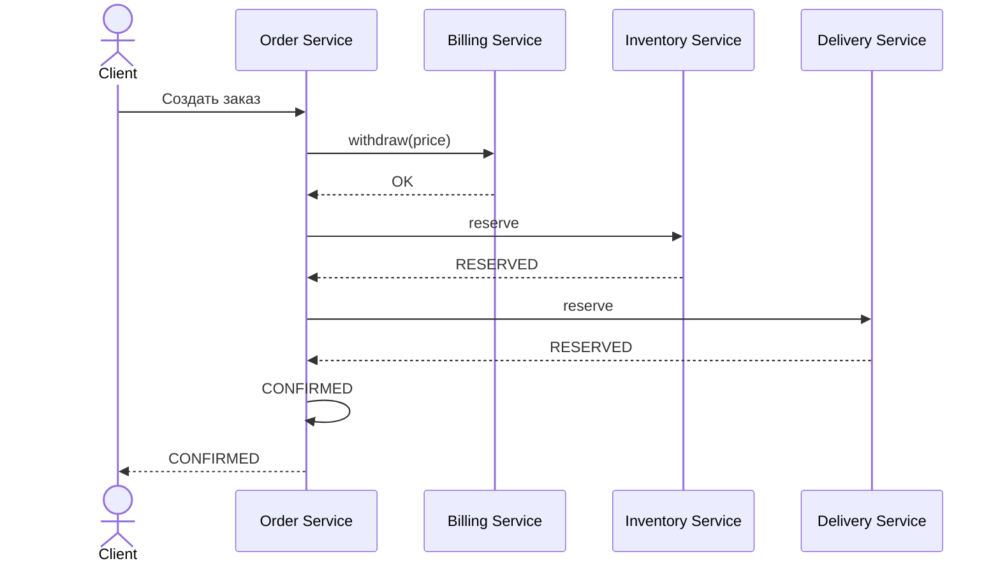
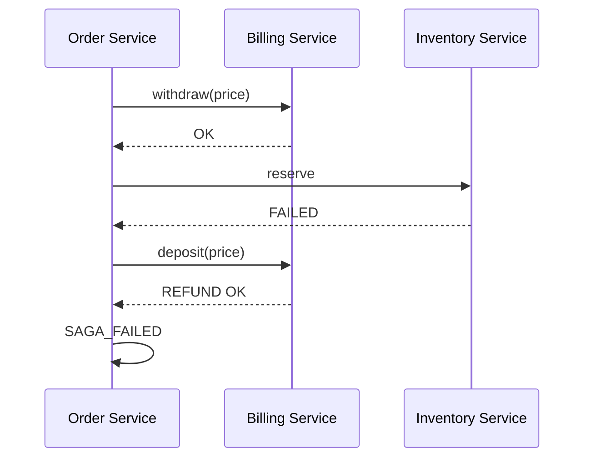
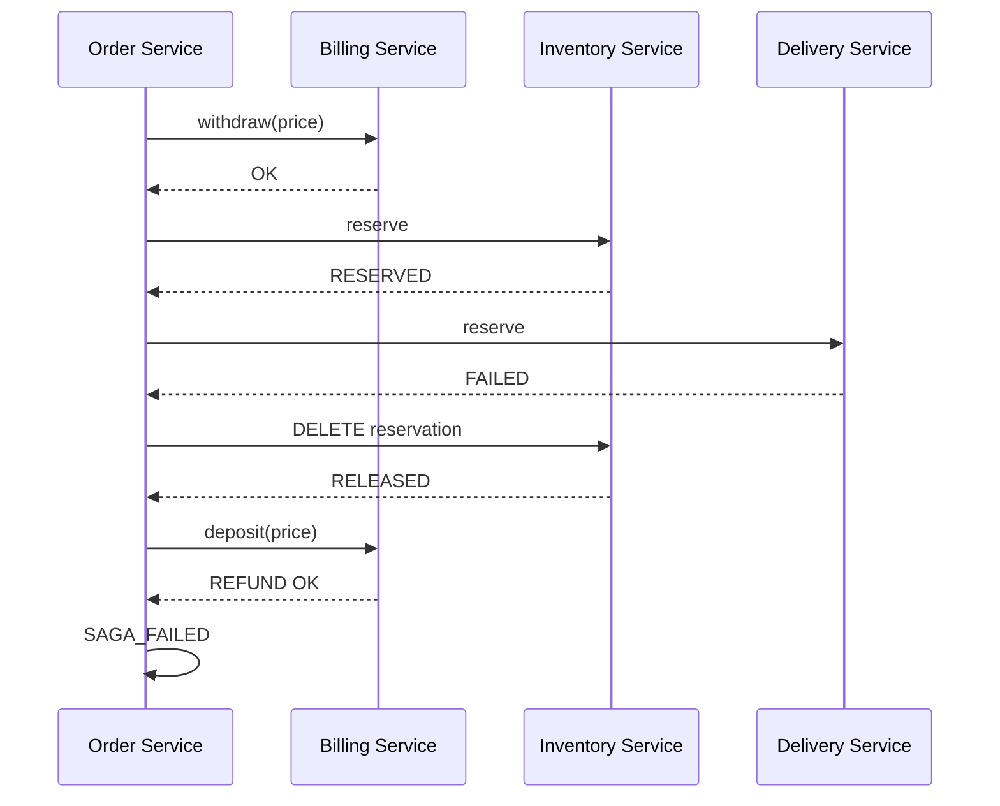
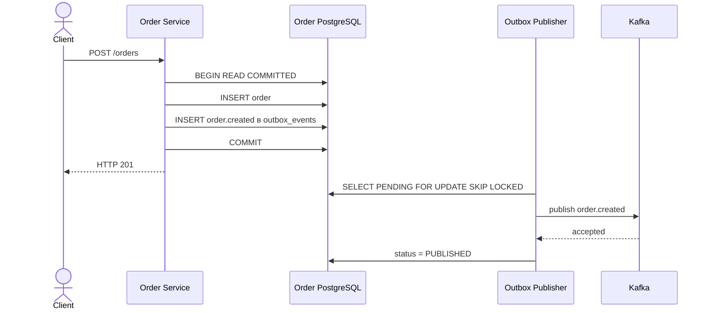

# Дополнение после ревью

## Inventory Service и Delivery Service

В проекте используются два подхода к распределённым операциям:

- Event Collaboration через Kafka для оплаты заказа;
- Saga Orchestration для Billing Service, Inventory Service и Delivery Service.

### Успешная Saga



### Ошибка Inventory



Если Inventory Service не смог зарезервировать товар, Order Service выполняет компенсацию — возвращает деньги через Billing Service.

### Ошибка Delivery



При ошибке Delivery Service выполняются две компенсирующие операции:

1. освобождение резерва Inventory;
2. возврат денег через Billing.

Компенсация Inventory реализована идемпотентно: повторный запрос освобождения уже освобождённого резерва не увеличивает остаток повторно.

---

## Transactional Outbox

Бизнес-данные и событие Outbox сохраняются в одной PostgreSQL-транзакции.



Если PostgreSQL-транзакция откатывается, одновременно откатываются заказ и Outbox Event. Поэтому событие о несуществующем заказе не публикуется.

Если PostgreSQL уже выполнил COMMIT, но Kafka временно недоступна, событие остаётся в состоянии `PENDING`. Outbox Publisher повторяет отправку до успешной публикации.

### Проверка недоступности Kafka

В ходе проверки Kafka broker у Order Service временно был заменён на недоступный адрес.

При недоступной Kafka:

```text
POST /orders -> HTTP 201
Order status -> NEW
order.created -> PENDING
attempts > 0
Billing balance -> 10000
```

После восстановления Kafka:

```text
order.created -> PUBLISHED
Billing Inbox -> событие получено
Billing balance -> 7000
payment.succeeded -> PUBLISHED
Order Inbox -> событие получено
Notification Inbox -> событие получено
Order status -> PAID
Notification status -> SUCCESS
```

Это подтверждает, что успешный COMMIT PostgreSQL не приводит к потере события при временной недоступности Kafka.

---

## Transactional Inbox

Каждое Kafka-событие содержит уникальный `eventId`.

Billing Service, Order Service и Notification Service сохраняют обработанные `eventId` в таблице `inbox_events`.

Обработка выполняется в следующем порядке:

```text
FetchMessage
    |
    v
BEGIN PostgreSQL transaction
    |
    +--> INSERT inbox_events(eventId)
    |
    +--> бизнес-операция
    |
    v
COMMIT PostgreSQL
    |
    v
CommitMessages Kafka
```

`CommitMessages` вызывается только после успешного COMMIT локальной PostgreSQL-транзакции.

Если приложение завершится после COMMIT PostgreSQL, но до Kafka CommitMessages, Kafka может доставить сообщение повторно. Inbox обнаружит уже существующий `eventId`, поэтому бизнес-операция второй раз не выполняется.

Таким образом используется:

```text
at-least-once delivery
+
idempotent consumer
```

### Проверка повторной доставки `order.created`

Один и тот же `order.created` был опубликован повторно с тем же `eventId`.

До повторной доставки:

```text
balance = 7000
payment events = 1
```

После повторной доставки:

```text
balance = 7000
payment events = 1
Billing Inbox records = 1
```

В логах Billing Service:

```text
Inbox: повторное order.created пропущено
```

Таким образом повторная доставка не приводит к повторному списанию денег.

### Проверка повторной доставки `payment.succeeded`

Тот же `payment.succeeded` также был опубликован повторно с тем же `eventId`.

Результат:

```text
Order Inbox records = 1
Notification Inbox records = 1
Order status = PAID
Notifications = 1
```

Повторная доставка не приводит к повторному изменению заказа или созданию второго уведомления.

---

## READ COMMITTED и SELECT FOR UPDATE

Для транзакций Billing Service явно используется уровень изоляции `READ COMMITTED`:

```go
pgx.TxOptions{
    IsoLevel: pgx.ReadCommitted,
}
```

Перед изменением баланса строка счёта блокируется:

```sql
SELECT id, user_id, balance, created_at, updated_at
FROM accounts
WHERE user_id = $1
FOR UPDATE;
```

Это предотвращает конкурентное изменение одного счёта на основании устаревшего значения `balance`.

### Проверка конкурентного списания

Начальный баланс:

```text
7000
```

Одновременно выполнены два запроса:

```text
withdraw 5000
withdraw 5000
```

Фактический результат:

```text
один запрос -> HTTP 200
второй запрос -> HTTP 409 insufficient funds
финальный balance -> 2000
```

Второй запрос получает блокировку только после завершения первого и видит уже актуальный баланс `2000`.

---

## Kafka offsets

Consumers используют `FetchMessage`, а `CommitMessages` выполняется только после успешного завершения PostgreSQL-транзакции.

Последовательность:

```text
Kafka FetchMessage
       |
       v
BEGIN DB transaction
       |
       v
Inbox + business operation
       |
       v
COMMIT PostgreSQL
       |
       v
CommitMessages Kafka
```

Если приложение завершится после COMMIT PostgreSQL, но до Kafka CommitMessages, сообщение может быть доставлено повторно. Повтор безопасен благодаря Inbox.

---

## Postman

В репозитории используется коллекция:

```text
postman/distributed-transactions.postman_collection.json
```

Перед сдачей необходимо приложить реальные скриншоты успешно пройденных тестов Postman для:

- успешной Saga;
- компенсации при ошибке Delivery.
