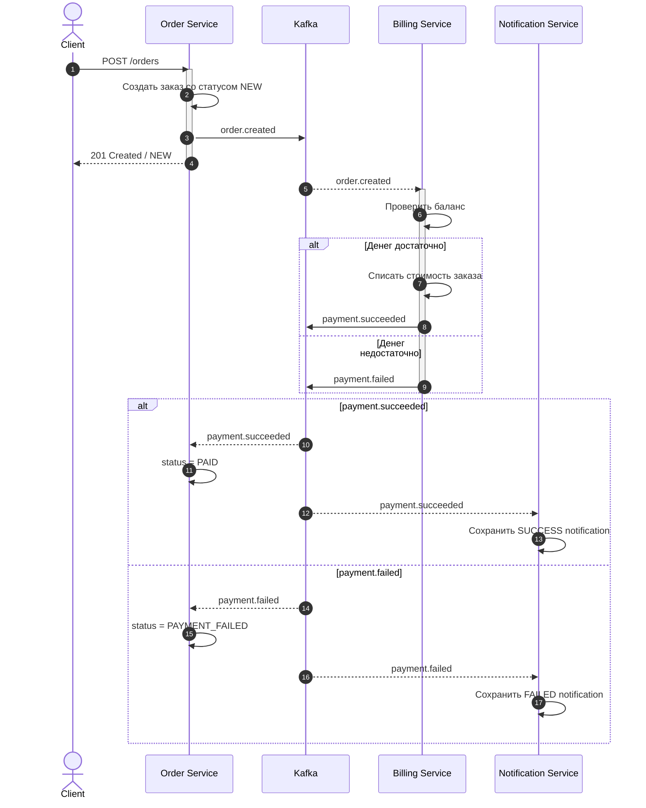
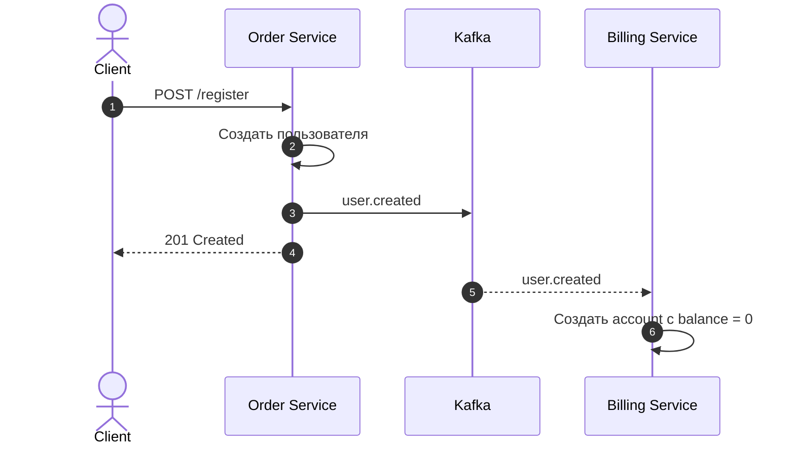
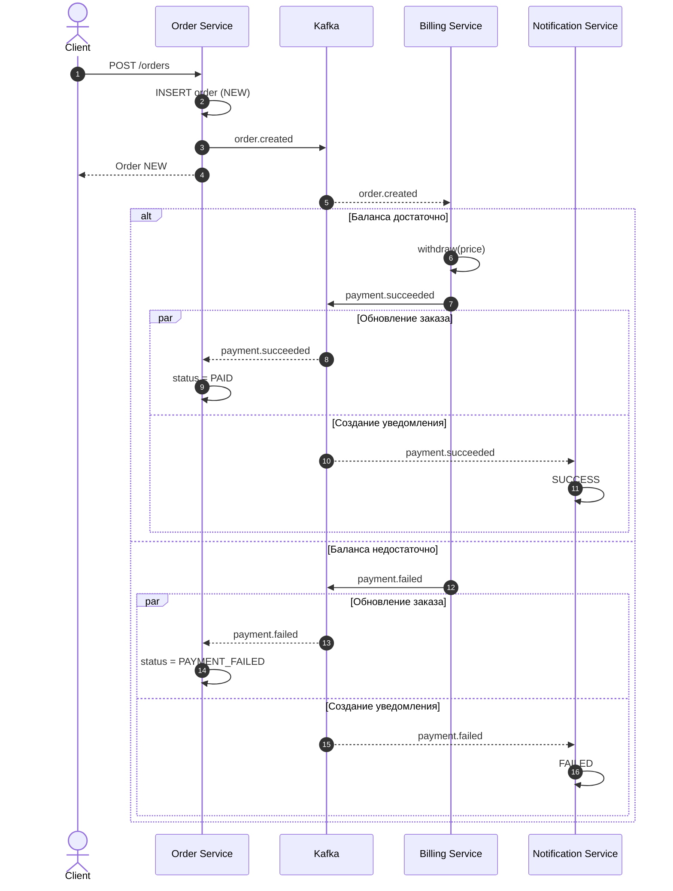
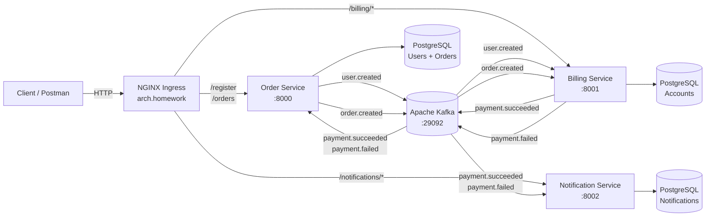

# Теоретическая часть — Stream Processing

## 1. Постановка задачи

Необходимо спроектировать взаимодействие следующих микросервисов:

- Order Service — пользователи и заказы;
- Billing Service — счета пользователей и операции с балансом;
- Notification Service — уведомления о результате оплаты;
- Kafka — брокер сообщений.

При регистрации пользователя для него должен автоматически создаваться
счёт в Billing Service.

Пользователь может пополнить свой счёт и создать заказ с указанной
стоимостью.

При создании заказа система должна попытаться списать деньги со счёта.

Если средств достаточно:

- деньги списываются;
- заказ получает статус `PAID`;
- создаётся успешное уведомление.

Если средств недостаточно:

- баланс не изменяется;
- заказ получает статус `PAYMENT_FAILED`;
- создаётся уведомление об ошибке оплаты.

Ниже рассмотрены несколько вариантов взаимодействия микросервисов.

---

# 2. Вариант 1 — только HTTP-взаимодействие

В этом варианте все сервисы взаимодействуют синхронно через HTTP.

Order Service является координатором процесса оплаты.

## Sequence diagram

```mermaid
sequenceDiagram
    autonumber

    actor Client
    participant Order as Order Service
    participant Billing as Billing Service
    participant Notification as Notification Service

    Client->>Order: POST /orders
    activate Order

    Order->>Billing: POST /billing/accounts/{userId}/withdraw
    activate Billing

    alt Денег достаточно
        Billing-->>Order: 200 OK + новый баланс
        deactivate Billing

        Order->>Order: status = PAID

        Order->>Notification: POST /notifications (SUCCESS)
        activate Notification
        Notification-->>Order: 201 Created
        deactivate Notification

        Order-->>Client: 201 Created / PAID

    else Денег недостаточно
        Billing-->>Order: 409 Conflict
        deactivate Billing

        Order->>Order: status = PAYMENT_FAILED

        Order->>Notification: POST /notifications (FAILED)
        activate Notification
        Notification-->>Order: 201 Created
        deactivate Notification

        Order-->>Client: 201 Created / PAYMENT_FAILED
    end

    deactivate Order
```

## Используемый HTTP API

Основные вызовы:

```text
POST /orders

POST /billing/accounts/{userId}/withdraw

POST /notifications
```

IDL для HTTP API приведён в:

```text
docs/openapi.yaml
```

## Плюсы

- простая и понятная последовательность вызовов;
- легко отлаживать;
- клиент быстро получает окончательный результат;
- не требуется брокер сообщений;
- легко реализовать для небольшого приложения.

## Минусы

- сильная связанность сервисов;
- Order Service должен знать адреса Billing Service и Notification Service;
- недоступность одного сервиса может нарушить весь сценарий;
- увеличивается время ответа клиенту;
- при добавлении новых действий необходимо изменять Order Service;
- возможны каскадные ошибки;
- сложнее масштабировать отдельные этапы бизнес-процесса.

---

# 3. Вариант 2 — HTTP + брокер сообщений только для уведомлений

В этом варианте Order Service и Billing Service взаимодействуют
синхронно через HTTP.

Результат оплаты публикуется в Kafka, а Notification Service получает
его асинхронно.

## Sequence diagram

```mermaid
sequenceDiagram
    autonumber

    actor Client
    participant Order as Order Service
    participant Billing as Billing Service
    participant Kafka
    participant Notification as Notification Service

    Client->>Order: POST /orders
    activate Order

    Order->>Billing: POST /billing/accounts/{userId}/withdraw
    activate Billing

    alt Денег достаточно
        Billing-->>Order: 200 OK + новый баланс
        deactivate Billing

        Order->>Order: status = PAID

        Order->>Kafka: payment.succeeded
        Order-->>Client: 201 Created / PAID

        Kafka-->>Notification: payment.succeeded
        Notification->>Notification: Сохранить SUCCESS notification

    else Денег недостаточно
        Billing-->>Order: 409 Conflict
        deactivate Billing

        Order->>Order: status = PAYMENT_FAILED

        Order->>Kafka: payment.failed
        Order-->>Client: 201 Created / PAYMENT_FAILED

        Kafka-->>Notification: payment.failed
        Notification->>Notification: Сохранить FAILED notification
    end

    deactivate Order
```

## HTTP API

```text
POST /orders

POST /billing/accounts/{userId}/withdraw
```

HTTP IDL:

```text
docs/openapi.yaml
```

## События

```text
payment.succeeded
payment.failed
```

IDL событий:

```text
docs/asyncapi.yaml
```

## Плюсы

- Notification Service не влияет на время ответа клиенту;
- отказ Notification Service не блокирует оплату;
- уведомления можно обрабатывать независимо;
- Notification Service можно масштабировать отдельно;
- можно добавить несколько обработчиков событий оплаты.

## Минусы

- Order Service всё ещё синхронно зависит от Billing Service;
- используется сразу два подхода взаимодействия;
- необходимо поддерживать HTTP и Kafka;
- процесс оплаты всё ещё частично централизован в Order Service;
- при недоступности Billing Service создание заказа может зависеть от его состояния.

---

# 4. Вариант 3 — Event Collaboration

В Event Collaboration сервисы не управляют друг другом напрямую.

Каждый сервис выполняет свою бизнес-функцию и публикует событие,
которое может заинтересовать другие сервисы.

В этом варианте Kafka является транспортом событий между сервисами.

Именно этот вариант реализован в практической части проекта.

## Sequence diagram



## Регистрация пользователя

Создание billing account также выполняется через событие.



## Используемые события

```text
user.created
order.created
payment.succeeded
payment.failed
```

AsyncAPI IDL:

```text
docs/asyncapi.yaml
```

## Плюсы

- слабая связанность микросервисов;
- Order Service не знает о Notification Service;
- Billing Service самостоятельно реагирует на создание заказа;
- Notification Service самостоятельно реагирует на результат оплаты;
- проще добавлять новые сервисы-потребители;
- хорошая масштабируемость;
- временная недоступность потребителя не обязательно приводит к потере события;
- сервисы можно развивать и масштабировать независимо;
- удобно добавлять аудит, аналитику и дополнительные обработчики событий.

Например, можно добавить Analytics Service, который будет читать
`order.created` и `payment.succeeded`, не изменяя Order Service и
Billing Service.

## Минусы

- архитектура сложнее HTTP-варианта;
- появляется дополнительный инфраструктурный компонент Kafka;
- данные становятся согласованными не мгновенно;
- используется eventual consistency;
- сложнее трассировать полный бизнес-процесс;
- необходимо следить за consumer groups и offsets;
- требуется обработка повторных сообщений;
- в production-системе желательно обеспечить идемпотентность;
- в production-системе желательно использовать Outbox Pattern для надёжной публикации событий.

---

# 5. Вариант 4 — наиболее подходящий вариант

Для данной задачи наиболее подходящим выбран вариант:

**Event Collaboration с использованием Kafka.**

Он совпадает с вариантом №3.

## Sequence diagram выбранного решения



## Почему выбран Event Collaboration

Order Service отвечает только за пользователей и заказы.

Billing Service отвечает только за счета и операции с балансом.

Notification Service отвечает только за уведомления.

Kafka связывает сервисы через бизнес-события.

В результате Order Service не обязан знать, какие ещё сервисы
заинтересованы в событии создания заказа или результате оплаты.

Например, после публикации:

```text
payment.succeeded
```

это событие одновременно могут использовать:

```text
Order Service
Notification Service
Analytics Service
Audit Service
Loyalty Service
```

При этом Billing Service изменять не требуется.

Для микросервисной архитектуры это обеспечивает более слабую
связанность компонентов и лучшую расширяемость системы.

---

# 6. Схема работы приложения

Практическая реализация использует Event Collaboration.



---

# 7. Kafka topics

В проекте используются следующие Kafka topics.

## user.created

Producer:

```text
Order Service
```

Consumer:

```text
Billing Service
```

Назначение:

Автоматическое создание счёта пользователя после регистрации.

---

## order.created

Producer:

```text
Order Service
```

Consumer:

```text
Billing Service
```

Назначение:

Запуск процесса оплаты нового заказа.

---

## payment.succeeded

Producer:

```text
Billing Service
```

Consumers:

```text
Order Service
Notification Service
```

Назначение:

- Order Service переводит заказ в `PAID`;
- Notification Service создаёт успешное уведомление.

---

## payment.failed

Producer:

```text
Billing Service
```

Consumers:

```text
Order Service
Notification Service
```

Назначение:

- Order Service переводит заказ в `PAYMENT_FAILED`;
- Notification Service создаёт уведомление о неуспешной оплате.

---

# 8. Согласованность данных

Event Collaboration использует модель eventual consistency.

Сразу после:

```text
POST /orders
```

Order Service может вернуть:

```text
NEW
```

После обработки Kafka-событий состояние заказа становится:

```text
PAID
```

или:

```text
PAYMENT_FAILED
```

Это ожидаемое поведение асинхронной событийной архитектуры.

---

# 9. Разделение ответственности

## Order Service

Отвечает за:

- регистрацию пользователей;
- хранение пользователей;
- создание заказов;
- хранение заказов;
- публикацию `user.created`;
- публикацию `order.created`;
- обработку `payment.succeeded`;
- обработку `payment.failed`.

---

## Billing Service

Отвечает за:

- создание счетов пользователей;
- хранение баланса;
- пополнение баланса;
- списание средств;
- обработку `user.created`;
- обработку `order.created`;
- публикацию `payment.succeeded`;
- публикацию `payment.failed`.

---

## Notification Service

Отвечает за:

- обработку результатов оплаты;
- сохранение уведомлений;
- выдачу списка уведомлений пользователя.

---

# 10. IDL

HTTP API описан в формате OpenAPI:

```text
docs/openapi.yaml
```

Kafka-события описаны в формате AsyncAPI:

```text
docs/asyncapi.yaml
```

Таким образом, в проекте представлены IDL как для синхронного HTTP API,
так и для асинхронного событийного взаимодействия.
